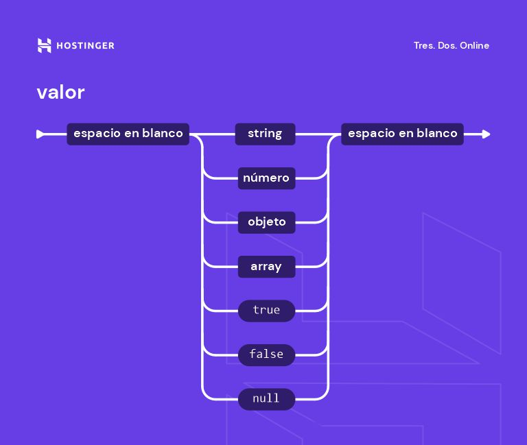

## ¿Que es JSON?

**JSON** **(JavaScript Object Notatión)**, es el formato texto que utiliza el famoso **lenguaje de programación JavaScript** para representar los objetos.

Al igual que **XML** es uno de los lenguajes de marcas mas utilizados y estandarizados para la representación y el **intercambio** de información.

**JSON** utiliza la misma notación o forma con la que se describen los objetos en **JavaScript**, literales de objetos, con algunas restricciones y extras.

Su **principal función** es el intercambio/transporte de información entre **servicios web** y los **clientes** conectados a dichos servicios.


## ¿Usos y Características?

+ **JSON** es un lenguaje de **modelador de datos**.

+ Consiste principalmente en pares **"clave-valor"**.

+ Los **valores** pueden estar basados en **cadenas, numeros o boleanos**, así como otros **objetos** JSON, con cualquier nivel de **anidación**.

+ Su formato es **flexible, ligero y facíl** de transferir por la red.

+ Comparte y transfiere información entre **distintos** tipos de software.

+ **Almacena** información en sistemas de **persistencia**.

## ¿Estructura, Ejemplo práctico y sintaxis?

La **estructura** de **JSON** esta compuesta por:

+ **{Llaves}** para representar **objetos**.  

+ **[Corchetes]**: para representar **arrays**.

+ **"comillas dobles""** para encerrar **atributos** y **cadenas** de objetos.

+ **Comas,**: Para separar las pares **clave/valor**.


### EJEMPLO JSON: 
```
{
    "libro": [
        {
            "id":"01",
            "lenguaje": "Java",
            "edición": "tercera",
            "author": "Herbert Schiildt"
        },
        {
            "id": "07",
            "lenguaje": "C++",
            "edición": "seguna",
            "author": "E.Balagurusamy"
        }
    ]
}
```
