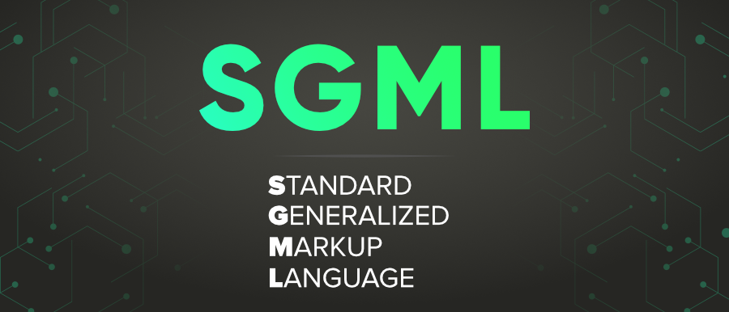

## ¿Que es SGML?

**SGML** **(Standart Generalized Markup Language)** es el estándar mejorado de GML, del cual se da origén al famoso lenguaje de marcas **HTML**.

A partir de **SGML** se dio:

+ **XML**
+ **HTML**

**HTML** fue creado para enviar información a tráves de la **World Wide Web** *(www)*, el cuál seguía el estandar **SGML**, y de ahí **XML** fue creado, como metalenguaje para almacenar información de forma **estructurada** y con **contenido semnantico** 



## ¿Usos y Características?

+ Transforma y unifica la información de un lenguaje a otro creando un **estandar**.

+ Mejora la estandarización implementada por parte de **GML**. 

## ¿Ejemplo práctico y sintaxix?

```
<etiqueta1> 
    <etiqueta2 atributo="valor">Información y Contenido</etiqueta2>
    <etiqueta3>Texto..</etiqueta3>
</etiqueta1>
```