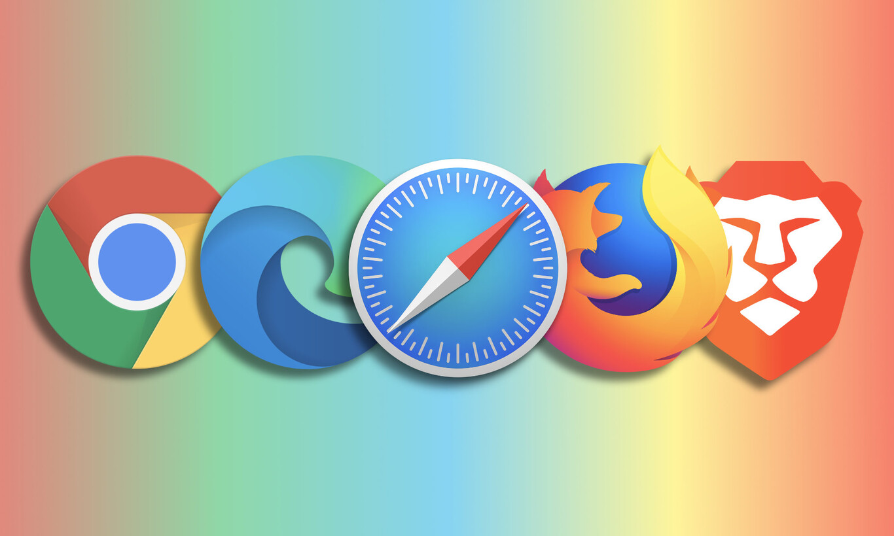

# ACTIVIDAD UD3 - Lenguaje de Marcas en la Web. 


## - **INDICE** ##
+ **HTML y su evolución**

+ **XHTML diferencias, ventajas y desventajas con respecto a HTML**

+ **Estructura de un documento HTML**

+ **Cabecera HTML**
    + **Title**
    + **Meta**
    + **Style**
    + **Link**
    + **Script**

+ **Cuerpo HTML** 
  + **Elementos de Bloque**
    + **Definir los diferentes elementos de bloque existentes**
  + **Elementos de Línea**
    + **Definir los diferentes elementos de línea existentes**
  + **Listas, tablas y Formularios**
  + **Elementos Multimedia para HTML5**
+ **Herramientas de edición y desarrollo web**


## - **HTML y su evolución** 

En esta **UD3**, voy a profundizar en uno de los lenguajes de marcas mas famosos y usados en el mundo **HTML**. Comenzaré hablando a modo de introducción sobre **HTML** para luego mas tarde abarcar su estructura, principales usos, su cuerpo...

**¿Donde se usa HTML?**

HTML es un lenguaje de marcas el cual permite estructurar mediante **etiquetas** una página **web**.

Cuando decimos **web** nos referimos a la **World Wide Web**, el cual es el servido de la **red Internet** más popular. Esta permite **compartir** documentos entre personas con **independencia** de la plataforma o **sistema operativo**.

El **correo electrónico** junto con la **web** son los servicios **más utilizados** y por los que ha tenido tanta **popularidad Internet**.


 
## - **Evolución de HTML**

Fue diseñado inicialmente en el año **1991** como parte del **CERN**, ha tenido varias versiones y diferentes **implantaciones**; veamos algunas de ellas:

| Año | Versión  | Observaciones |
|----------|----------|----------|
| 1991    | Diseñado inicial   | ```Incluye 18 etiquetas se considera dialecto SGML```   |
| 1992   | HTML 1.1  | ```Primer Borrador```  |
| 1995   | HTML 2.0   | ````Recomendación W3C````   |
| 1997    | HTML 3.2   | ```Recomendación W3C```  |
| 1997    | HTML 4.0   | ```Recomendación W3C```|
| 1999    | HTML 4.1   | ```Recomendación W3C```|
| 2000    | XHTML   | ```Publicado como recomendación del W3C. Tiene como objetivo sustituir a HTML pero se desarrolló el estándar HTML 5 por otro lado```  |
| 2014    | HTML 5.0   | ```Recomendación W3C```|
| 2016    | HTML 5.1 | ```Recomendación W3C```|
| 2017    | HTML 5.2   | ```Recomendación W3C```|

----
###  **¿XHTML?**

**XHTML** es un estándar que extiende HTML con las propias características del **metalenguaje XML**. Por ello, sigue las mismas reglas del mismo (XML) **a diferencia** de HTML.

Su estructura es **similar** al propio HTML pero con **algunas diferencias**:

  + **Las etiquetas deben estar bien animadas.**
  + **Todas las etiquetas deben estar cerradas.**
  + **Todas las etiquetas y atributos van en minúscula.**
  + **No puede haber texto sin estar dentro de una etiqueta.**
  + **Todos los atributos deben tener valor e ir entre comillas.**
  + **No se deben insertar elementos de bloque dentro de elementos inline.**
  + **Los scripts y estilos deben ir dentro de un CDATA**
  


----
##  **NAVEGADOR**

El **navegador** es el programa diseñado para la **visualización HTML** que permite tener una versión más legible y visual al usuario.

Algunos de los navegadores más **usados**:

  + Mozilla Firefox

  + Google Chrome
  
  + Microsoft Edge

  + Opera

  + Safari



 ---------------
##  **ESTRUCTURA DE HTML**

A continuación un ejemplo basico de la **estructura** de un documento **HTML**:

```HTML
<!DOCTYPE html>                 <!-- Doctype para validar el documento --> 
<html>
<head>                          <!-- Cabecera --> 
 <meta charset='utf-8'>
 <meta http-equiv='X-UA-Compatible'
content='IE=edge'>
 <title>Titulo Página</title>
 <meta name='viewport'
content='width=device-width,
initial-scale=1' >
 <link rel='stylesheet' type='text/css'
media='screen' href='main.css'>
 <script src='main.js'></script>
</head>
<body>                          <!-- Cuerpo --> 

</body>
</html>                         <!-- Etiquetas de apertura y cierre --> 


<!-- Ejemplo HTML --> 
``````
----

Como se puede observar la etiqueta **raíz** del documento es **< html >**. Esta etiqueta será la **raíz del documento**; permite tener una serie de **atributos** comunes a todas las etiquetas HTML.

| ETIQUETA | DESCRIPCIÓN  |
|----------|----------|
| class    | Identifica la clase para agrupar estilos.   |
| contentEditable   | El contenido es editable  | 
| hidden   | No se representa en el navegador |
| id    | Identificador del elemento   |
| lang    | Lenguaje que esta escrito   |
| spellcheck    | El elemento debe ser analizado para la ortografía   |
| style    | asigna un estilo   |
| tabindex    | Orden de selección de elementos   |
| title    | Información Extra |
| translate    | Determina si un elemento debe ser traducido  |

-----
### - **Entidades**

En HTML se pueden utilizar **entidades** al igual que **XML** para representar caracteres especiales *(o las vocales con tilde)*.

| ENTIDAD | DESCRIPCIÓN  |
|----------|----------|
| & copy;    | &copy;   |
| & aacute;   | &aacute;  | 
| & eacute;   | &eacute; |
| & quot;    | &quot;   |
| & euro;    | &euro;   |
| & gt;    |  &gt;    |
| & lt;    | &lt;   |

------------------------------------------------------------------

### - **Comentarios** 

Al igual que en **XML**, se pueden utilizar **comentarios**.

````HTML
<!-- Esto es un comentario -->
````````
## - **CABECERA HTML**:


La **cabecera** dentro de un documento **HTML** tiene la principal **función** establecer información **del propio** documento a través de **metadatos//scripts//estilos** del mismo.


La etiqueta que recibe la cabecera de HTML es --> **< head>** la cual debe de cerrarse con --> **< /head>**. Como **principales elementos** del **< head>** encontramos los siguientes:


  + **Title**: Indica el título de la página.
  + **Meta**: Define los metadatos de la página.
  + **Style**: Indica el estilo a utilizar.
  + **Link**: Enlace con otro documento (para estilos).
  + **Script**: Añade Scripts basado en lenguaje para Scripts.