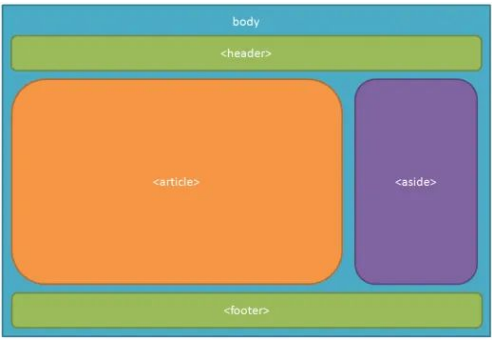

#  **ELEMENTOS EN BLOQUE // CUERPO HTML**

## - **Qué son?** 

Como comentaba anteriormente **son aquellos que ocupan** todo el espacio **disponible de su padre o contenedor**.

En este documento detallaré los **distintos** elementos que podemos encontrar y su **significado**.

En HTML 5 encontramos una **característica** a destacar entre otras la cual es que las etiquetas de **bloque** con un **significado semántico**; permiten establecer el **contexto** y además contenido de una web **estructurándola**:



Como podemos ver en la imagen tenemos los siguientes elementos:

###  **Header** 

Indica la **cabecera** de la web; almacena el **encabezado** de una web o sección *normalmente*, también suele venir acompañado de un **logotipo junto a un titulo** de la propia web.

```HTML
<header>
 <div class="container">
 <p></p>
 <h1>Centro Deportivo Aguadulce </h1>
 </div>
</header>
```
#### **NAV**

En el ejemplo anterior, esta etiqueta es utilizada para agregar **enlaces de navegación**, estos enlaces pueden ser **internos o externos**.

Lo reconocemos por venir representado como un menu de navegación con **hiperenlaces** entre las diferentes secciones de la web.

```HTML
<nav>
 <div class="enlaces">
 <a href="#inicio">Inicio</a>
 <a href="#actividades">Actividades</a>
 <a href="#galeria">Galeria</a>
 <a href="#contacto">Contacto</a>
 </div>
 </nav>
```

###  **Main** 

Esta etiqueta **delimita** el espacio del contenido principal; donde dentro pueden haber **diferentes secciones y artículos**.

Es **importante** que exista una única etiqueta main para delimitar este espacio, y que esté bien estructurada, con **distintas secciones**.

Ahora si, como vemos en la imagen, dentro del **main** encontramos etiquetas **section** y **article**.

###  **Aside** 

Permite **definir un contenido** auxiliar dentro del contenido **principal** de tal forma que sea un contenido **fijo** que muestre o un *menú* o *información* de interés general de la pagina.

###  **Section** 

La etiqueta **section**, delimita las distintas secciones de una página; sobre todo se utiliza para **separar y dar
significado semántico** a la web. 

Por ejemplo:

```HTML
<section id="inicio">
 <div class="container">
 
 <p>Practicar deporte es esencial para mantener un estilo de
vida saludable, beneficiando el corazón, la mente y el cuerpo. Nuestro
centro ofrece instalaciones de vanguardia que incluyen gimnasios bien
equipados, canchas modernas y piscinas exteriores e interiores. ¡Únete a
nosotros y vive el deporte!</p>
 </div>
</section>
```

###  **Article** 

La etiqueta **article**, almacena información como una **unidad independiente**; como
puede ser un artículo de una *noticia* o un *comentario*. No tiene una representación
como tal pero sí es importante semánticamente.

Por ejemplo:

```HTML
<article
 <h3>Documental del tragico final de Harambe, el gorila de espalda plateada</h3>
 <p> esta es una historia….</p>
</article>
```

###  **Footer** 

La etiqueta **footer** delimita el **pie de una página**; normalmente delimita enlaces generales de la página o información sobre la misma, como puede ser
**contacto** o **dirección de correo**.

Por ejemplo:


Por ejemplo:

```HTML
<footer>
 <div class="pie">
 <div class="subpie">
 <p>Pepe perez</p>
 <p>LM | ASIR | 2023/2024</p>
 </div>
 <div class="subpie">
 <a href="https://www.instagram.com/">Siguenos en Instagram</a>
 <p>Teléfono: 954123456</p>
 <p>Dirección: Avda. del deporte, s/n</p>
 </div>
 </div>
 </footer>
```

###  **Div** 

La etiqueta **div**, permite almacenar un contenedor de tal forma que podamos
almacenar **conjunto de contenedores** con contenido de forma **personalizada**.

Por ejemplo:

```HTML
<div class="subpie">
 <p>Pepe perez</p>
 <p>LM | ASIR | 2023/2024</p>
</div>
```

###  **Otras etiquetas** 

#### address

La etiqueta address, permite almacenar una dirección, ya sea física o un correo
electrónico

Por ejemplo:

```HTML
<address>
Para contactar con la web puede enviar un correo a <a
href=”mailto:aa@aa.com”>aa@aa.com</a>
</address>
```

#### details

La etiqueta details, permite mostrar un contenido textual cuando se despliega el
componente.

Esta etiqueta contiene el elemento hijo summary; que será el que aparece como
título del detalle.


Por ejemplo:

```HTML
<details>
 <summary>Pincha aqu&iacute;</summary>
Este contenido está desplegado.
</details>
```

#### dialog

La etiqueta dialog, muestra un diálogo al usuario. Esta información estará visible
si tiene el atributo open añadido.


Por ejemplo:

```HTML
<dialog open>
 La compra se ha realizado correctamente.
</dialog>
```

#### figure

La etiqueta figure permite mostrar una imagen con una figura o leyenda. 

Se
añade dentro de esta etiqueta figcaption; que establece esta leyenda. 

Por ejemplo:

```HTML
<figure>
 El logotipo de la web</figcaption>
</figure>
```

#### hr

La etiqueta hr, establece un delimitador o separador entre secciones;
normalmente se muestra como una línea horizontal.

```HTML
<hr/>
```

#### pre

La etiqueta pre o texto preformateado, permite mostrar un texto tal y como está escrito
en el documento html; respetando saltos de página, tabulaciones y espacios. 

Utiliza una fuente con ancho fijo.


```HTML
<pre>
 esto esto
 esta esta
preformateado preformateado
</pre>
```