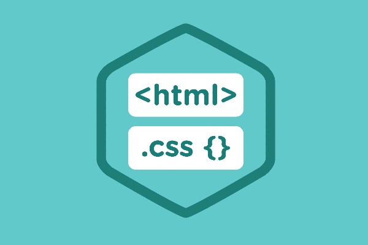
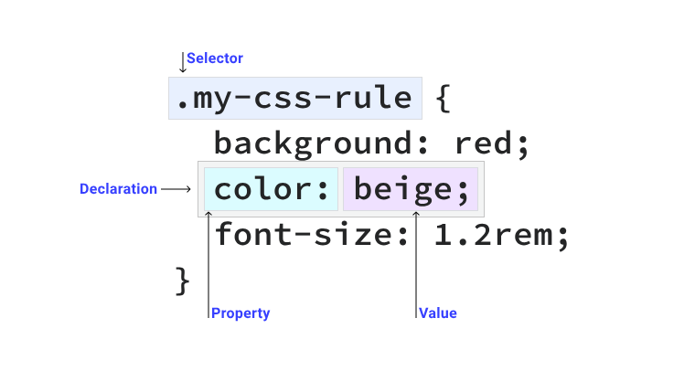

# ACTIVIDAD UD4 - Estilos en documentos Web. 


## - **Indice** ##
+ **CSS, Qué es:**
+ **Versiones CSS**
+ **Como se agrega CSS a un documento HTML**
+ **Selectores CSS (incluyendo pseudoclases y pseudoselectores)**
+ **Tipos de datos y unidades CSS**
+ **Versiones CSS:** 
  + **Modelo de cajas**
  + **Flex y Grid**
  + **FLoat y position**
  + **Propiedades de texto**
  + **Propiedades de Listas**
  + **Diseño adaptativo (Media Queries)**
-----------------------------------------

## - **CSS: Qué es?** 

En esta **UD4**, voy a profundizar en el uso de **CSS**, un lenguaje de marcas con el que damos formato y **estilo** a nuestros documentos **HTML**. En el siguiente apartado veremos **qué es** realmente **CSS** su **uso principal**, su relacción con **HTML** y un pequeño **ejemplo**.

También como **puntos de aprendizaje** principales que quiero llevar acabo en esta unidad son:

+ **Estudiar la estructura y sintaxis CSS**
+ **Aprender como se aplica CSS a los documentos**
+ **Presentar los tipos utilizados para definir colores, tipos de letras y unidades de medida**
+ **Estudiar las propiedades que podemos modificar desde los estilos CSS**

El uso de **HTML** sin formato esta **obsoleto** a dia de hoy, es normal ver documentos web HTML acompañados con un formato de estilo con **CSS** **(Cascade Style Sheets)**.

**CSS** permite añadir **estilo** a un documento web **HTML** mejorando su **presentación** y haciendo más **visual** la **información**.



Es mantenido por **W3C** al igual que **HTML Y XML**. Comenzó en **1996** y hoy en dia su uso es **indispensable** para el desarrollo de cualquier **página web**. Ha habido diferentes **versiones**:

| Año | Versión  | Descripción |
|----------|----------|----------|
| 1996    | CSS1    | El W3C ya no soporta esta versión   |
| 1998    | CSS2   | El W3C ya no soporta esta versión |
| 2011   | CSS2.2   | Corrección de errores de la versión 2   |
| 2012    | CSS3    | Esta versión la divide en modulos. Por lo que no hay fecha de cambio.  |

- ### **Sintaxis:**

Podemos **dividir** la sintaxis de **CSS** en:

+ **Selectores:** Herramientas que permiten seleccionar el **elemento o elementos** en los cuales se van a aplicar las reglas.

+ **Declaraciones:** Son las **reglas** para aplicar a los distintos elementos. Normalmente tienen una estructura **clave valor**.

+ **Comentarios:** Se aplican mediante los caracteres /* */

**EJEMPLO:**

```CSS
body{
 color: green;
}
```
----

 ### **Agregar CSS:**

Podemos añadir estilos con **CSS** a un documento **HTML** de las **siguientes maneras**:

- Como documento **externo** mediante la **etiqueta link**:

```HTML
<link rel=”stylesheet” href=”estilos.css” >
```

- Como **elemento style** dentro de la **cabecera** del documento:

```HTML
<style>
…
</style>
```

- Como **elemento en línea** con la etiqueta **style**:

```HTML
<p style=”color:white”>...</p>
```
---

  ### **Prioridades de uso con CSS**

Podemos establecer una serie de **valores** para cada regla, para establecer la **prioridad**.

- **inherit**: Activa la herencia, dando prioridad al valor heredado del elemento padre.
- **initial**: El valor tomado será el valor **por defecto**.
- **unset**: Reestablece al **valor natural**.
- **revert**: Reestablece el valor propiedad al valor que hubiera **obtenido** si no se hiciese el **cambio**.
----

 ### **Selectores CSS**

Un **selector** es una regla para **seleccionar** uno o varios elementos que **modificarán** sus **reglas**; podemos dividirlos en los siguientes **tipos**:

- **Universal**: selecciona todos los elementos. EJ: *
- **Tipo**: tipo de elemento. EJ: h1
- **Clase**: elementos de una determinada clase.
- **Identificador**: elemento con un identificador en concreto. EJ: #elemento
- **Atributo**: elemento con un atributo en concreto. EJ: ```input[type=”submit”]```

También existen **combinaciones o agrupaciones**:

- **Agrupación**: aplicará las reglas a todos esos elementos o clases. EJ: h1,h2,h3.

- **Combinación**: indica que sólo aplicará a la combinación de varios elementos. Podemos clasificarlos como:
  - Hermanos: Elemento hermano a otro; ejemplo: A~B.
  - Hijos: Elemento Hijo a otro; ejemplo: A>B.
  - Hermanos adyacentes: Elemento hermano a otro pero adyacente; ejemplo: A+B.
  - Descendientes: Elemento descendente;Ejemplo A B.

  

----

**Pseudoclases**: Es un modificador que se añade a un **selector** para que solo se **aplique** cuando dicho elemento pase a un estado **específico**; 
```CSS
selector:pseudoclase{
color: white;
}
```

Algunas de las pseudoclases son: 

- **:active:** cuando el elemento está activo.
- **:checked:** cuando un checkbox está activo.
- **:disabled:** cuando el elemento está deshabilitado.
- **:focus:** Cuando el elemento tiene el foco.
- **:hover:** Cuando el ratón pasa por encima.
- **:visited:** Cuando el enlace apunta a una dirección ya visitada
anteriormente

**Pseudoelementos**: Se añade a un selector para **establecer** el estilo de parte de dicho elmeneto; Por ejemplo **la primera** letra o palabra.

Los **pseudoelementos** pueden ser:

- **::after:** Permite añadir contenido después del elemento.
- **::before:** Permite añadir contenido antes del elemento.
- **::first-letter:** Primera letra del primer bloque de texto.
- **::first-line:** Primera línea del primer bloque de texto.
- **::selection:** Modificar el estilo cuando hay parte del contenido
seleccionado.

----

 ### **Tipos de Datos y Unidades**

En **CSS** podemos encontrar los siguientes **tipos de datos**:

- **Entero**: Numeros enteros positivos y negativos.
- **Número**: Número decimal.
- **Dimensión**: Número con una dimensión asociada; puede ser deg **(grados)**, s (segundos) o px **(píxeles)**
- **Porcentaje**: Indica un porcentaje o fracción el cual se indica con el símbolo **%**.
- **Colores**: Indica un color que puede ser uno predeterminado **(green, red, white...)** valor **RGB (rgba(22,33,11,20))**, hexadecimal **(#112233)** o HSL **(Hue Saturation Lightness)** **(hsl(0,100%.50%))**.

En cuanto a las **Unidades** podemos clasificarlas en **Absolutas o Relativas**.

*Unidades Absolutas:*

- **px**: píxeles.
- **cm**: centímetro.
- **mm**: mílimetro.
- **Q**: Cuarto de mílimetro.
- **in**: Pulgada.
- **pt**: Puntos (1/72 in).
- **pc**: Picas (1/16 in).

*Unidades Relativas*

- **em**: Tamaño letra del padre.
- **ex**: Altura de la fuente del elemento.
- **ch**: Ancho del carácter.
- **rem**: Tamaño letra del elemento Raíz.
- **lh**: Altura de la línea del elemento.
- **vw**: 1% del ancho de ventana gráfica.
- **vh**: 1% del alto de la ventana gráfica.
- **vmin**: 1% de la dimensión más pequeña de la ventana gráfica.
- **vmax**: 1% de la dimensión más grande de la ventana gráfica.
