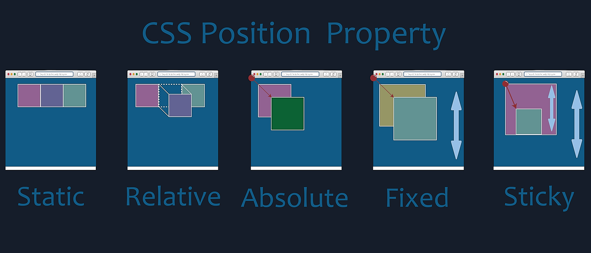

#  **Propiedades CSS**

## - **Position** 

La **posición** de un elemento dependerá de su **contenedor** o de la **propiedad** de la cual hablaremos hoy *position*; la cual tiene los siguientes **valores**:

- **static**: valor por defecto; se posiciona siguiendo el flujo normal.
- **relative**: permite establecer su posición de forma relativa al anterior elemento.
- **absolute**: establece la posición absoluta respecto al documento. 
- **fixed**: El elemento deja de seguir el flujo normal del documento.
- **Sticky**: El elemento se posiciona siguiendo el flujo normal y se puede establecer la posición límite con su contenedor.

*Con las propiedades top, left, right y bottom, se pueden cambiar la posición*.

