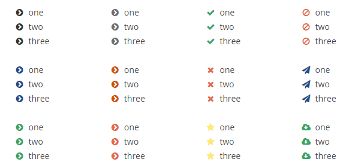

#  **Propiedades CSS**

## **Propiedades de listas**

Estas son las propiedades que podemos establecer en las **listas**:

- **list-style-type**: Indica el tipo de viñeta a utilizar; tiene los valores: *disc,circle, square, decimal, lower-roman, upper-roman,
lower-greek, lower-latin, lower-latin y none.*

- **list-style-position**: Establece la posición de las viñetas; pueden ser *inside* u *outside^.

- **list-style-image**: Establece una viñeta como una imagen pasando una URL.

