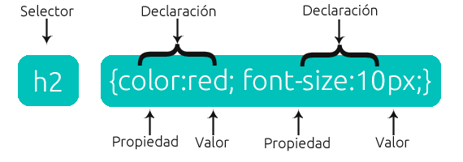

#  **Propiedades CSS**

## **Propiedades de texto**

Podemos establecer una serie de propiedades para dar formato al **texto**:

- **color**: color del texto.

- **font-family**: el tipo de letra; se establece como una lista con propiedad.

- **font-size**: Tamaño del texto.

- **font-weight**: Determina el grosor del trazo.

- **text-align**: Determina la alineación del texto; tiene los valores *left*, *right*, *center* y *justify*.

- **letter-spacing**: espacio entre letras.

