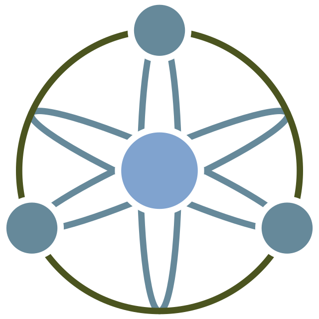
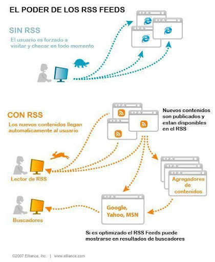

# ACTIVIDAD UD5 - Sindicación de contenidos web. 




## - **Indice** ##
+ **Sindicación de contenidos en la web**
+ **Sindicación de contenidos**
+ **RSS (Sintaxis y ejemplos)**
+ **Atom (sintaxis y ejemplos)**
+ **Herramientasde validación de canales de sindicación**
+ **Añadir canales de sindicación a una web** 
+ **Agregores de canales**
+ **Canales de sindicación**
-----------------------------------------

## - **Sindicación de contenidos en la web** 

En esta **UD5**, hablaré sobre el uso de la sindicación de contenidos en la web, viendo su importancia para poder **difundir** en **internet** el contenido de nuestra web con **HTML** y **CSS**, ya que para esto necesitaremos del uso de esta.

No siempre es fácil dar con el contenido o dar a conocer nuestro contenido. Para ello las **herramientas de sindicación de contenidos** para poder difundir esta información.

También como **puntos de aprendizaje** principales que quiero llevar acabo en esta unidad son:

+ **Conocer los fundamentos y la utilidad de los sitemas de difusión**
+ **Analizar los formatos  más utilizados en redifusión**
+ **Presentar diversas herramientas para la creación y el consumo de canales de información**
+ **Enumerar algunos canales de información interesantes de diversos ámbitos**



Es mantenido por **W3C** al igual que **HTML, XML y CSS**. 

----

 ## **Sindicación de contenidos:**

 Los **sistemas de redifusión web** o **sindicación web** permiten liberar de trabajo a los usuarios a la hora de **proporcionar** un mecanismo de suscripción gracias al cual la información de la web llega a los usuarios **en vez de buscarla**.

Algunos de estos sistemas se basan en canales de redifusión llamados **fuente web, canal web, o web feed**.

Una **fuente web** es un documento el cual contiene **información básica** sobre elementos de información incluyendo referencias para **acceder a estos elementos**.

Existen varios formatos basados en **XML**: como puede ser **Atom** o **RSS**.

 ## **RSS:**

El formato **RSS** *(Really Simple Syndication)* es un **dialecto** XML, que permite distribuir contenidos a través de la **web**.

Al igual que **XML** es mantenido por la **W3C** y fue publicada su primera versión en **1997**; actualmente es **utilizada la v2.0** publicada en 2003.

Su extensión puede ser **.xml** o **.rss**

- ### **Sintaxis**:

+ El elemento raíz siempre sera < rss > que tendrá el **atributo: version**  con el valor **2.0**.

+ Este **elemento** tendra un **subelemento** llamado < channel > por cada canal de **suscripción** que tenga la web.

En el elemento **channel**; tendremos los siguientes elementos obligatorios:

| Elemento | Descripción  | 
|----------|----------|
| < tittle >    | Titulo del canal    | 
| < link >    | Enlace al sitio web   | 
| < description >   | Descripción del contenido | 
| < language >    | Idioma en el que está escrito el canal |
| < copyright >    | Aviso relativo a los derechos de autor |
| < category >    | Una o más categorias a la que pertenece el canal |
| < generator >    | Nombre del programa que ha generado el canal | 

Además de estos elementos, podemos encontrar una o más entradas definidas con el elemento **< item >**. Cada elemento contiene:

| Elemento | Descripción  | 
|----------|----------|
| < tittle >    | Titulo de la entrada    | 
| < link >    | Enlace a la entrada   | 
| < description >   | Descripción de la entrada | 
| < pubDate >    | Fecha de publicación en formato RFC-822 |
| < comments >    | Contiene la URL con los comentarios de la entrada |
| < author >    | Dirección electrónica (email) del autor |

- ### **Ejemplo RSS:**

```RSS
<?xml version="1.0" encoding="UTF-8" ?>
<rss version="2.0">

<channel>
  <title>Carlos Home Page</title>
  <link>https://www.carlosgithub.com</link>
  <description>Directorio UD5 Ejemplo RSS</description>
  <item>
    <title>RSS Ejemplo primer articulo</title>
    <link>https://www.carlosgithub/RSSejemplo</link>
    <description>Articulo de RSS con ejemplo</description>
  </item>
</channel>

</rss>
```

Podemos **dividir** la sintaxis de **CSS** en:

+ **Selectores:** Herramientas que permiten seleccionar el **elemento o elementos** en los cuales se van a aplicar las reglas.

+ **Declaraciones:** Son las **reglas** para aplicar a los distintos elementos. Normalmente tienen una estructura **clave valor**.

+ **Comentarios:** Se aplican mediante los caracteres /* */

**EJEMPLO:**

```CSS
body{
 color: green;
}
```
----

 ### **Agregar CSS:**

Podemos añadir estilos con **CSS** a un documento **HTML** de las **siguientes maneras**:

- Como documento **externo** mediante la **etiqueta link**:

```HTML
<link rel=”stylesheet” href=”estilos.css” >
```

- Como **elemento style** dentro de la **cabecera** del documento:

```HTML
<style>
…
</style>
```

- Como **elemento en línea** con la etiqueta **style**:

```HTML
<p style=”color:white”>...</p>
```
---

  ### **Prioridades de uso con CSS**

Podemos establecer una serie de **valores** para cada regla, para establecer la **prioridad**.

- **inherit**: Activa la herencia, dando prioridad al valor heredado del elemento padre.
- **initial**: El valor tomado será el valor **por defecto**.
- **unset**: Reestablece al **valor natural**.
- **revert**: Reestablece el valor propiedad al valor que hubiera **obtenido** si no se hiciese el **cambio**.
----

 ### **Selectores CSS**

Un **selector** es una regla para **seleccionar** uno o varios elementos que **modificarán** sus **reglas**; podemos dividirlos en los siguientes **tipos**:

- **Universal**: selecciona todos los elementos. EJ: *
- **Tipo**: tipo de elemento. EJ: h1
- **Clase**: elementos de una determinada clase.
- **Identificador**: elemento con un identificador en concreto. EJ: #elemento
- **Atributo**: elemento con un atributo en concreto. EJ: ```input[type=”submit”]```

También existen **combinaciones o agrupaciones**:

- **Agrupación**: aplicará las reglas a todos esos elementos o clases. EJ: h1,h2,h3.

- **Combinación**: indica que sólo aplicará a la combinación de varios elementos. Podemos clasificarlos como:
  - Hermanos: Elemento hermano a otro; ejemplo: A~B.
  - Hijos: Elemento Hijo a otro; ejemplo: A>B.
  - Hermanos adyacentes: Elemento hermano a otro pero adyacente; ejemplo: A+B.
  - Descendientes: Elemento descendente;Ejemplo A B.

  

----

**Pseudoclases**: Es un modificador que se añade a un **selector** para que solo se **aplique** cuando dicho elemento pase a un estado **específico**; 
```CSS
selector:pseudoclase{
color: white;
}
```

Algunas de las pseudoclases son: 

- **:active:** cuando el elemento está activo.
- **:checked:** cuando un checkbox está activo.
- **:disabled:** cuando el elemento está deshabilitado.
- **:focus:** Cuando el elemento tiene el foco.
- **:hover:** Cuando el ratón pasa por encima.
- **:visited:** Cuando el enlace apunta a una dirección ya visitada
anteriormente

**Pseudoelementos**: Se añade a un selector para **establecer** el estilo de parte de dicho elmeneto; Por ejemplo **la primera** letra o palabra.

Los **pseudoelementos** pueden ser:

- **::after:** Permite añadir contenido después del elemento.
- **::before:** Permite añadir contenido antes del elemento.
- **::first-letter:** Primera letra del primer bloque de texto.
- **::first-line:** Primera línea del primer bloque de texto.
- **::selection:** Modificar el estilo cuando hay parte del contenido
seleccionado.

----

 ### **Tipos de Datos y Unidades**

En **CSS** podemos encontrar los siguientes **tipos de datos**:

- **Entero**: Numeros enteros positivos y negativos.
- **Número**: Número decimal.
- **Dimensión**: Número con una dimensión asociada; puede ser deg **(grados)**, s (segundos) o px **(píxeles)**
- **Porcentaje**: Indica un porcentaje o fracción el cual se indica con el símbolo **%**.
- **Colores**: Indica un color que puede ser uno predeterminado **(green, red, white...)** valor **RGB (rgba(22,33,11,20))**, hexadecimal **(#112233)** o HSL **(Hue Saturation Lightness)** **(hsl(0,100%.50%))**.

En cuanto a las **Unidades** podemos clasificarlas en **Absolutas o Relativas**.

*Unidades Absolutas:*

- **px**: píxeles.
- **cm**: centímetro.
- **mm**: mílimetro.
- **Q**: Cuarto de mílimetro.
- **in**: Pulgada.
- **pt**: Puntos (1/72 in).
- **pc**: Picas (1/16 in).

*Unidades Relativas*

- **em**: Tamaño letra del padre.
- **ex**: Altura de la fuente del elemento.
- **ch**: Ancho del carácter.
- **rem**: Tamaño letra del elemento Raíz.
- **lh**: Altura de la línea del elemento.
- **vw**: 1% del ancho de ventana gráfica.
- **vh**: 1% del alto de la ventana gráfica.
- **vmin**: 1% de la dimensión más pequeña de la ventana gráfica.
- **vmax**: 1% de la dimensión más grande de la ventana gráfica.
