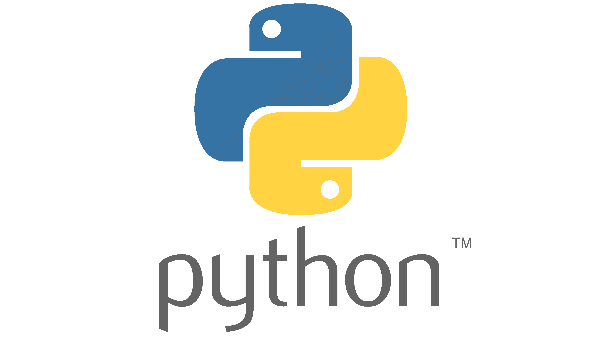

# ACTIVIDAD UD6 - Almacenamiento usando Lenguajes de Marcas 

## - **Indice** ##
+ **Introducción a Python**
  + **Python (definición del lenguaje)**
  + **Variables**
  + **Tipos de datos**
  + **Estructuras de control**
  + **Listas**
  + **Tuplas**
+ **JSON**
  + **Definición**
  + **Elementos**
  + **Tipos de datos simples**
  + **Listas (arrays)**
  + **Objetos**
+ **MongoDB**
  + **Definición del motor de base de datos**
  + **Instalación y configuración con Docker**
  + **Pymongo**
    + **Insertar**
    + **Consulta**
    + **Borrar**
    + **Modificar**

-----------------------------------------

- ## **[PYTHON](Python.md)**

- ## **[JSON](JSON.md)**

- ## **[MongoDB](MongoDB.md)**