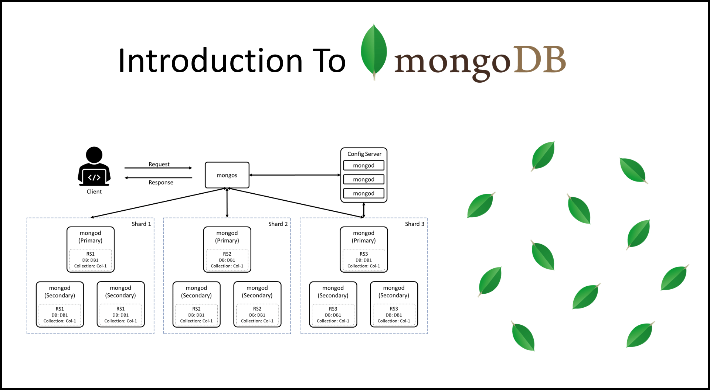
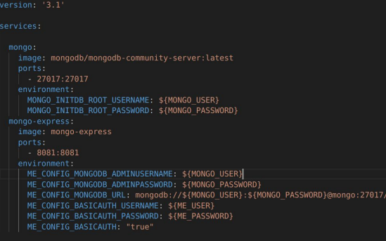
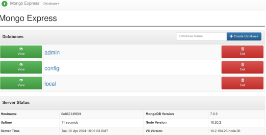
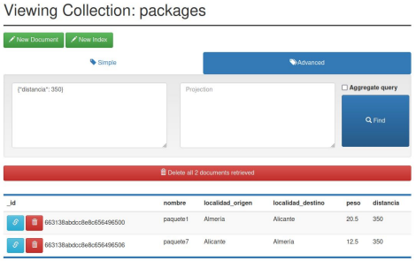
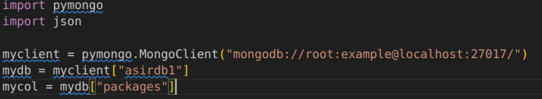
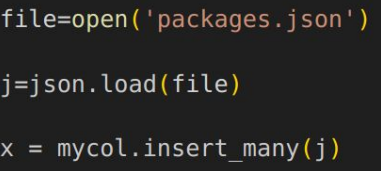

# JSON


## - **Indice** 

+ **Definición del motor de base de datos**
+ **Instalación y configuración con Docker**
+ **Pymongo**
    + **Insertar**
    + **Consulta**
    + **Borrar**
    + **Modificar**

## - **Objetivos** 

+ **Instalar y conocer una base de datos basada en un Lenguaje de marcas**.

+ **Instalar y configurar una instancia de MongoDB**.

+ **Utilizar la librería *pymongo* para utilizar la base de datos MondoDB**.


## - **Definición** 

**MongoDB** es una base de datos **NoSQL** de código **abierto** que se basa en **documentos**. Lo que principalmente le diferencia de las bases de datos **relacionales tradicionales** las cuales almacenan datos en **tablas** con *filas* y *columnas*, es que *MongoDB* almacena los datos en documentos **BSON** *(una forma binaria de JSON)*.

Esta **estructura** de almacenamiento permite mayor **flexibilidad** y **escalabilidad**.



### - **Características de MongoDB**

+ **1.Modelo de documentos**: MongoDB utiliza un modelo basado  en documentos, donde cada documento es similar a un objeto
JSON y puede contener datos anidados. Esto permite representar datos complejos y relacionados de manera natural.


+ **2.Esquema flexible**: A diferencia de las bases de datos relacionales, MongoDB no requiere que los documentos tengan un
esquema predefinido. Los documentos dentro de una misma colección pueden tener estructuras diferentes, lo que facilita la
adaptación a cambios en los datos.


+ **3.Consulta poderosa**: Ofrece un lenguaje de consulta rico y expresivo que permite realizar búsquedas avanzadas, filtrado, clasificación, agrupación y más. También permite operaciones de agregación similares a las funciones de
agrupamiento en bases de datos relacionales.


+ **4.Escalabilidad horizontal**: Soporta la división de datos (sharding) en múltiples servidores, lo que permite manejar
grandes volúmenes de datos y cargas de trabajo distribuidas.


+ **5.Indices**: Al igual que en otras bases de datos, Oermite crear índices en campos específicos para acelerar las consultas y mejorar el rendimiento.


+ **6.Soporte para replicación**: Ofrece replicación integrada para garantizar la disponibilidad y durabilidad de los datos.
Los datos pueden ser replicados en diferentes nodos para garantizar la continuidad del servicio en caso de fallas.


+ **7.Compatibilidad con múltiples lenguajes**: iene controladores disponibles para una amplia variedad de lenguajes
de programación, incluidos JavaScript, Python, Java, C#, y otros, lo que facilita su integración en aplicaciones.


## - **Instalación y configuración con Docker**

Podemos instalarlo mediante diferentes **formas** *(Local, nube, embebido, etc...)* una de las formas más **sencillas** de utilizar,  es a través de un **contendor Docker**.

Existe una **imagen Docker** para *MongoDB* (*version Community*), para poder crear una **instancia** de forma sencilla, podemos lanzar las siguientes **lineas de comando**:

````
docker run --name mongodb -p 27017:27017 -d
mongodb/mongodb-community-server:latest
````

También tenemos la opción del uso de **Docker Compose**:




## - **Mongo Express**

*Mongo Express* es una **aplicación web** en la que podemos **contectar y administrar** una instancia en *MongoDB*.



Con *Mongo Express* podemos **realizar consultas** e **insertar** documentos.

Para realizar consultas en *MongoDB*, utilizamos **JSON**:

````JSON
{“numero”: 5}
````

Esta consulta obtendría todos los **documentos** que tengan el **atributo** "numero" igual a **5**.




## - **MongoDB Consultas**

*MongoDB* tiene las siguientes operaciones para trabajar con consultas **JSON**:

| Operación | Operando  | Descripción | Ejemplo |
|----------|----------|----------|---------|
| Igual    |  :  | ```Obtienen valores iguales```   | {“distancia”: 5} |
| No igual que    | $ne   | ```Valores distintos de```  | {“distancia: {$ne:5} |
| Menor Que   | $lt   | ````Valores menores que````   | {“distancia”: { $lt:50}} |
| Mayor Que     | $gt   | ```Valores mayores que```  | {“distancia”: {$gt:50}} |
| Expresión Regular    | “$regex”   | ```Una expresión regular ```| {“origen”: {“$regex”: “^S”}} |


## - **PyMongo**

*PyMongo* es un **paquete** para el lenguaje **Python**, el cual al instalarlo nos permite poder **conectarnos** a una base de datos **MongoDB**.

Podemos **instalarlo** usando el **gestor de paquetes *pip***:

```
pip install pymongo
```

Gracias a *pymongo* podemos conectar una **instancia** de MongoDB, con el siguiente fragmento:



En este fragmento, nos conectamos a una **instancia local** y obtenemos tanto la
**base de datos** como una **colección**.

### - **Insertar**

Para insertar en una **colección**, podemos utilizar ```insert_one()``` insertando un **solo elemento** (utilizando un diccionario o también JSON).

También si queremos **insertar varios elementos** simultaneamente, podemos utilizar la función ```insert_many()`` pasándole una colección en JSON o diccionarios.



### - **Consulta**

Podemos obtener todos los objetos de una **colección**, usando la función ``find()``, la cual devolverá un cursor, que podemos recorrer con un ```for``

``result = mycol.find()
for n in result:
 print(n)``

También podemos utilizar un diccionario o documento en **JSON** como consulta:

``query = { “address”: “fake street, 123”}
result = mycol.find(query)
for n in result:
 print(n)``

### - **Modificar o Borrar**

De igual manera, podemos **modificar o borrar elementos** usando las funciones ``update_one`` o ``delete_one`` (también está la versión ``_many``)

``query = { “address”: “fake street, 123”}
mycol.update_one(query, newvalues)
#Borrar todos los elementos
mycol.delete_many({})``