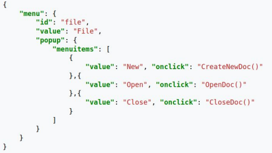

# JSON


## - **Indice** ##

+ **Definición del motor de base de datos**
+ **Instalación y configuración con Docker**
+ **Pymongo**
    + **Insertar**
    + **Consulta**
    + **Borrar**
    + **Modificar**


## - **Definición** ##

**JSON** *(JavaScript Object Notation)* es un lenguaje de marcas que se utilizaba como parte de la representación de datos en el lenguaje **JavaScript**.

Pero la **comunidad** ha extendido su uso como lenguaje de marcas **independiente**, y podemos verlo siendo **utilizado** en infinidad de usos.



### - **Sintaxis**

La sintaxis de **JSON** *(/jeyson)* esta basada en **etiquetas clave**: valor, separadas por comas y componiendo diferentes objetos dentro de **etiquetas** { }.

Esta comenzaría con ````{```` seguidos de uno o varios elementos separados por , .

Cada uno de los elementos, se **define** como un par de **clave-valor**, separado por : la primera parte es la clave que va entre **comillas** " " y la segunda parte es el valor.

**EJEMPLO**

```JSON
"nombre": "carlos"
```

Cada elemento puede tener un **valor simple**, una **lista** o un **objeto**.

+ Un **valor simple**, es un objeto con un único valor.

+ Una **lista**, es uno o varios objetos dentro de las etiquetas [ ].

+ Un **objeto**, es uno o varios elementos dentro de las etiquetas { }.


## - **Tipos de datos**

Un valor **simple**, tiene asociado un tipo; que puede ser:

+ **Números**: Indica un número que puede ser entero o decimal (separado por . como coma decimal).

+ **Cadenas**: Una cadena de caracteres encerrada entre " ".

+ **Booleanos**: Sólo pueden tener el valor *true* o *false*.

+ **Null**: Indica un valor nulo o vacío.

**EJEMPLOS**

+ **Numéricos**:

```JSON
{"edad": "20"}
```

+ **Cadenas**:

```JSON
{"nombre": "carlos"}
```

+ **Booleanos**:

```JSON
{"Venta": true}
```

+ **Nulos**:

```JSON
{"segundo nombre": null}
```

## - **Objetos Compuestos**

Los **objetos** en JSON son un **conjunto de subelementos** que componen en sí a **elementos**. 

Diciendolo de otra manera, son **elementos compuestos**. Estos se **definen** dentro de las etiquetas  ````{ }````.

```JSON
{"primernombre":"Carlos" , "segundonombre":"Sanchez"}
```

## - **Listas**

Las **Listas**, o también conocidas como **Arrays** son un conjunto de elementos que tienen una **posición** u **índice**. Estas son definidas dentro de los elementos  ````[ ]```` y cada elemento está separado por comas.

```JSON
"empleados":[
{"primernombre":"Carlos" , "primerapellido":"Sanchez"}
{"primernombre":"Victor" , "primerapellido":"Suarez"}
{"primernombre":"Juan" , "primerapellido":"Sanchez"}
]
```

## - **Ejemplo JSON**

```JSON
{
    "Pedidos": [
        {
            "Fecha":"08-05-2024",
            "id":"01",
            
            "productos": [
                {
                    "nombre": "pedido1",
                    "referencia":"REF-P-01",
                    "precio":"99.99€"
                }
            ],

            "cliente": [
                {
                    "Nombre":"Carlos",
                    "DNI":"78321237G",
                    "Dirección":"C.Aguadulce N 100"
                }
            ],

            "lineapedido": [
                {
                    "referencia":"REF-P-01",
                    "cantidad":"2"
                }
            ]
        }
    ]
}
```

## - **Aplicaciones JSON**

JSON tiene infinidad de **aplicaciones**:

+ **Almacenar información**.

+ **Configuración de aplicaciones**.

+ **Intercambio de aplicaciones a través de servicios HTTP (o servicios web REST)**.

