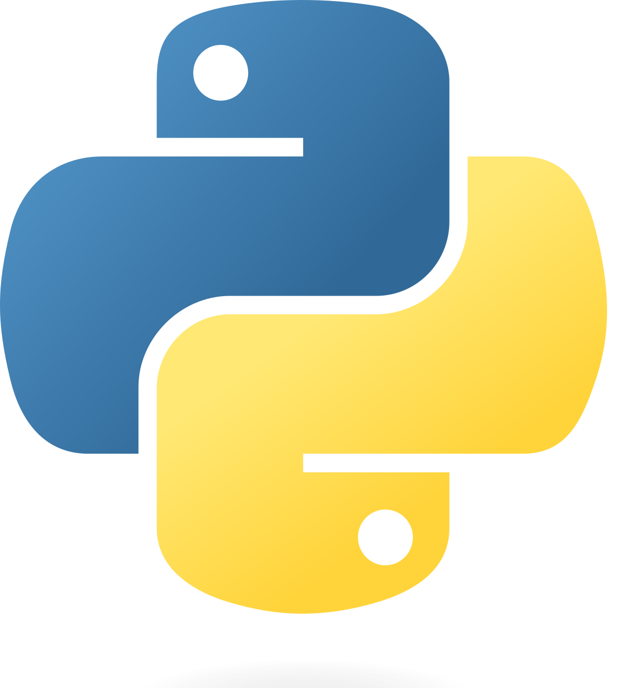
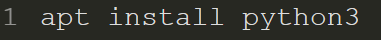
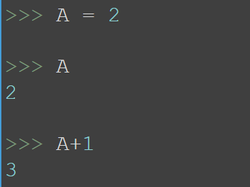

# Python

## - **Indice** ##
+ **Introducción a Python**
  + **Python (definición del lenguaje)**
  + **Variables**
  + **Tipos de datos**
  + **Estructuras de control**
  + **Listas**
  + **Tuplas**

## - **Introducción a Python** ##

**Python** es un **lenguaje de programación** que nos permite **realizar** programas para nuestro **ordenador, movil, tablet, etc...**

Los desarrolladores utilizan **Python** porque es **eficiente y fácil de aprender**, además de que se puede ejecutar en muchas **plataformas** diferentes. 

Se puede **descargar gratis**, se integra bien a **todos los tipos de sistemas** y aumenta la **velocidad del desarrollo**.

### - **Instalación**

Para **instalar** Python, nos descargaremos el **paquete** python desde los repositorios de **rasbian**.

## - **Programar con Python**

Las **variables** nos permiten almacenar en ellas **resultados de procesos** para usarlas en nuestro **codigo**.

Podemos usar los **números o letras** para poder realizar **acciones con python**. A veces es necesario para **almacenar** estos datos.

