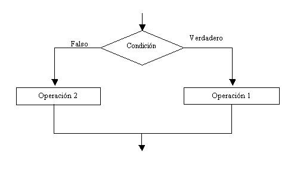
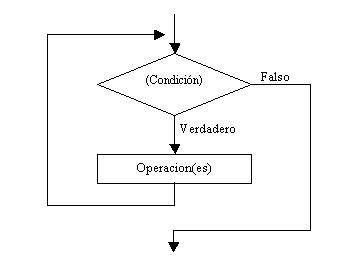

# Python


## - **Indice** ##
+ **Introducción a Python**
  + **Python (definición del lenguaje)**
  + **Variables**
  + **Tipos de datos**
  + **Estructuras de control**
  + **Listas**
  + **Tuplas**


## - **Introducción a Python** ##

**Python** es un **lenguaje de programación** que nos permite **realizar** programas para nuestro **ordenador, movil, tablet, etc...**

Los desarrolladores utilizan **Python** porque es **eficiente y fácil de aprender**, además de que se puede ejecutar en muchas **plataformas** diferentes. 

Se puede **descargar gratis**, se integra bien a **todos los tipos de sistemas** y aumenta la **velocidad del desarrollo**.

### - **Instalación**

Para **instalar** Python, nos descargaremos el **paquete** python desde los repositorios de **rasbian**.


## - **Programar con Python**

Las **variables** nos permiten almacenar en ellas **resultados de procesos** para usarlas en nuestro **codigo**.

Podemos usar los **números o letras** para poder realizar **acciones con python**. A veces es necesario para **almacenar** estos datos.


```python
>>> A = 2

>>> A
2

>>> A+1
3
```

```python
A = 1
a = 3
>>> a+A
A = '1'
```

También podemos hacer **comparaciones**:

```python
>>> A = 2
>>> B = 3
>>> A > 0
True
>>> B >= A
False
```
Las **tabulaciones** son muy importantes, estas indican cuando **acaba y termina** cada bloque.

```python
#Codigo correcto
if a>1:
    a=a+1

#codigo incorrecto
if a>1:
a=a+1
```

## - **Instrucciones de Control**

Las **instrucciones de control** son necesarias para poder **decidir** la **acción** a realizar o también para **repetir** una **serie de acciones**.

Hay **dos tipos** de **instrucciones de control**:

+ **Control Condicional**

+ **Control Repetitivo**

### - **Instrucciones de Control Condicional**

Las instrucciones de control **condicional** nos permiten poder elegir que hacer en función de una **condicion**:



**EJEMPLO**:

```python

if a> 1:
    printf("a es mayor que 1")
else:
    printf("a es menor o igual que 1")

```

Tenemos **3 instrucciones de control condicional**:

+ **IF** --> Comprueba una condición y **realiza** una serie de acciones.

```python

#Ejemplo If
if a > 1:
    a=a+1

```

+ **IF-ELSE** --> Comprueba una condición y realiza una **serie de acciones** u otras en caso de **no cumplirse**.

```python

#Ejemplo If-else
if a > 1:
    a=a+1
else:
    a=a-1

```

+ **IF-ELIF-ELSE** --> Comprueba una serie de condiciones y realiza las acciones que **contemplen** dichas condiciones.

```python

#Ejemplo If-elif-else
if a == 1:
    a=a+1
elif a==1:
    a=a+2
else:
    a=a-1

```

### - **Instrucciones de Control Repetitivo**

Las instrucciones de control **repetitivo** nos permiten **repetir** acciones a partir de **una** o **varias** condiciones.



Tenemos **2 instrucciones de control repetitivo** o también conocidos como **Bucles**:

+ **WHILE** --> Este bucle permite ejecutar **repetidamente** unas intrucciones **mientras** ocurra una condición:

```python

#Ejemplo Mientras

while a>1:
    a=a-1

```

+ **FOR** --> Este bucle permite **repetir una serie** de acciones a partir de un **contador** o mientras se **recorre** una lista.

```python

#Ejemplo for

for i in range(1,10):
    a=a+i

```


## - **Listas**

Las listas nos permiten **guardar** una serie de valores en una **variable/lista**, la cual nos ahorra el tener que crear una **variable** por cada **valor** que tengamos.

Podemos crear una lista **vacia**:

```python

Lista = []

```

O con **datos**:

```python

Lista = [2, 3, 4, 5]

```

Si queremos **consultar** un dato de la lista debemos de usar un **indice**, el cual comienza por **0**:

```python

Lista[0]
1
Lista[2]
4
```

Con el **bucle for** podemos **recorrer una lista** para que nos devuelve todos los **valores** que esta contiene:

```python

for n in lista:
    print(n)

1
2
3
4
5
```

También dar uso a **operadores** dentro de una lista:

```python

Lista[:2]
[1,2,3]

Lista[1:3]
[2,3]

Lista2 = [7,8]

Lista+Lista2

[1,2,3,4,5,6,7,8]

```

## - **Tuplas**

Las **tuplas** tienen el mismo comportamiento que las listas, teniendo como **excepción** que estas no se pueden **modificar**:

```python

Tupla = (1,2,3,4)

Tupla[0]
1
Tupla[:2]
(1,2)
Tupla[1:3]
(2,3)
```