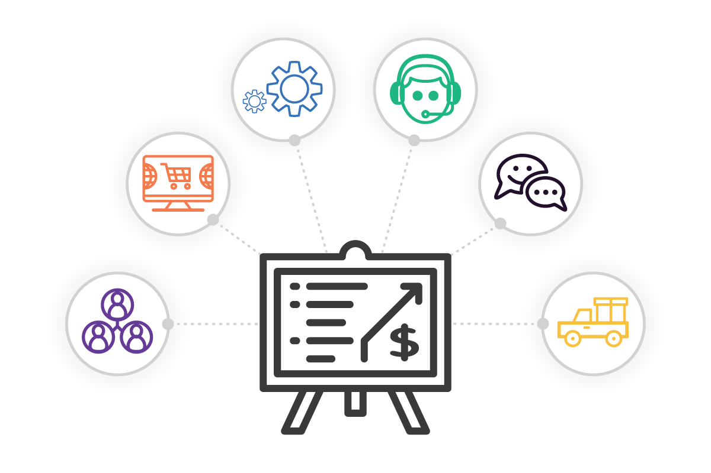

# ACTIVIDAD UD7 - Sistemas de Gestión de Información. 

## - **Indice** ##
+ **Sistemas de gestión de información**
  + **Características**   
  + **Tipos**

+ **ERP**
  + **Características y beneficios**
  + **Ejemplos de ERPs más conocidos**

+ **CRM**
  + **Características y beneficios**
  + **Ejemplos de CRMs más conocidos**

+ **BI**
  + **Definición y componentes**
    + **ETL**
    + **Data WareHouse**
    + **OLAP**
    + **Data Mining**
    + **DashBoard**

-----------------------------------------

## - **Sistemas de Gestión de Información** 

En esta **UD7**, veremos que son los **Sistemas de Gestión de Información** como funcionan y sus diferentes características.

#### **¿Que son?**

Programas informáticos, diseñados para dar soporte a cualquiera de los procesos que se realizan en una empresa.

Lo que permitirá a las empresas, poder mejorar sus procesos y obtener un mayor beneficio en su actividad.

#### **¿Y sus Características?**

+ Podemos encontrar Sistemas de Gestión de Información tanto en **local** como en la **nube**.

+ Hay distintos tipos de Sistemas de gestión de Información como pueden ser **ERP**, **CRM** o el uso de *Businness Intelligence* **BI**.

#### **Tipos de Sistemas de Gestión de Información:**

+  [ERP](ERP.md)

+  [CRM](CRM.md)

+  [BI](BI.md)
