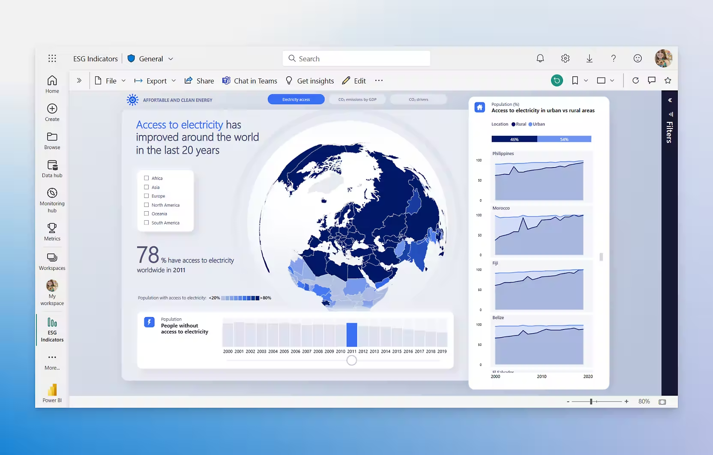

#  **Tipos de Sistemas de Gestión de Información**

## - **BI (Bussines Inteligence):** 

Bussines Inteligence o Inteligencia de Negocio son las siglas B.I por las que llaman a una serie de tecnologías que tienen un objetivo en concreto; ayudar al **proceso de dirección de una empresa**.

No es un Sistema de Gestión de Información como tal, pero si se compone de una **serie de sistemas** que ayudan a este proceso:

+ ETL (proceso de extracciíon de procesos)
+ Data Warehouse (almacén de datos procesados)
+ OLAP (Procesamiento analítico en línea)
+ Data Mining (Minería de datos)
+ Dashboard

## - **ETL**

*Extract, tranform and Load* es el nombre que recibe el proceso por el cual **se obtiene información de las operaciones diarias realizadas por la empresa**, se procesan y se guardan en un almacén de datos.

ETL no es un único proceso como tal, sino puede ser **un conjunto de procesos que ayudaban a recabar información**.

## - **Data Warehouse**

Es el conjunto de datos de una compañia que **permite una correcta toma de decisiones**

No solo almacena los datos **en bruto**, sino que también los procesados por un ETL.

## - **OLAP**

*Online Analytical Procesing* el procesamiento analítico en línea nos facilita el acceso a los datos almacenados en el anterior mencionado **Data Warehouse**, el cual alimenta al minado de datos **Data Mining que posteriormente hablaremos de el.

En muchas ocasiones, los datos de OLAP vienen representados como un CUBO. 

## - **Data mining**

El minado de datos o *Data mining* es el proceso el cual **busca patrones repetitivos** en grandes volúmenes de datos, los cuales normalmente son obtenidos de los almacenes de datos del **Data Warehouse**

## - **DashBoard**

El DashBoard o como en España se conoce como Cuadro de Mandos, es un proceso o aplicación que facilita de forma visual ver los datos **en conjunto de forma general**, para hechar un vistazo a los datos requeridos e **incluso hacer rapidas acciones**

