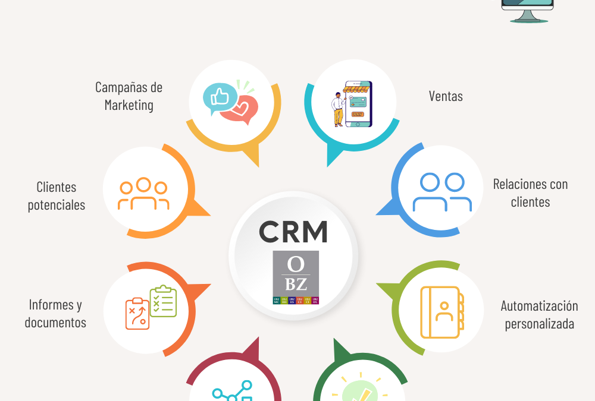

#  **Tipos de Sistemas de Gestión de Información**

## - **CRM:** 

CRM *(Customer RelationShip Management)* es uno de los 3 tipos de Sistemas de Gestión de Información **específico** para resolver todo lo que tenga relación con el lado de los **clientes** y su relación con la propia **empresa**.

Es una herramienta fundamental para la gestión del **activo más importante** de cualquier empresa.

## - **Caracteristicas CRMs**

Puedo destacar entre varias las siguientes:

+ **Gestión de contactos**: Para tener en cada momento **las interacciones con los clientes**

+ **Clasificación de los clientes**: Ayuda a segmentar a los clientes para mejorar el **marketing**

+ **Unificación de canales**: Unifica todos los canales de comunicación para que estos **sean 1** para el cliente.

+ **Automatización y seguimiento de flujos de trabajo**: Automatizar y seguir el flujo de las **acciones realizadas**con el cliente.

+ **Gestión de redes sociales**: Mejora la **interacción** con los clientes mediante la buena gestión de las **redes sociales**

## - **Beneficios**

+ **Facilita la toma de decisiones**: Al unificar los datos de los clientes. 
+ **Incrementan las oportunidades de venta**: Es mas sencillo acertar al ofrecer nuevos productos/servicios ya que se conoce mas sobre los clientes.
+ **Posibilitan realizar acciones de marketing eficaces**: Gracias a la clasificación de los clientes.
+ **Ayudan en el proceso de mejora continua**: La satisffación de los clientes especificada en datos relativos junto a posibles incidencias, permiten detectar los puntos debiles de la empresa.

**EJEMPLO ERPs**:
```Markdown
+ Salesforce.
+ Microsoft Dynamics 365 CRM (Microsoft).
+ Zoho CRM.
+ SAP Customer Experience.
+ Oracle Custome Experience.
```

