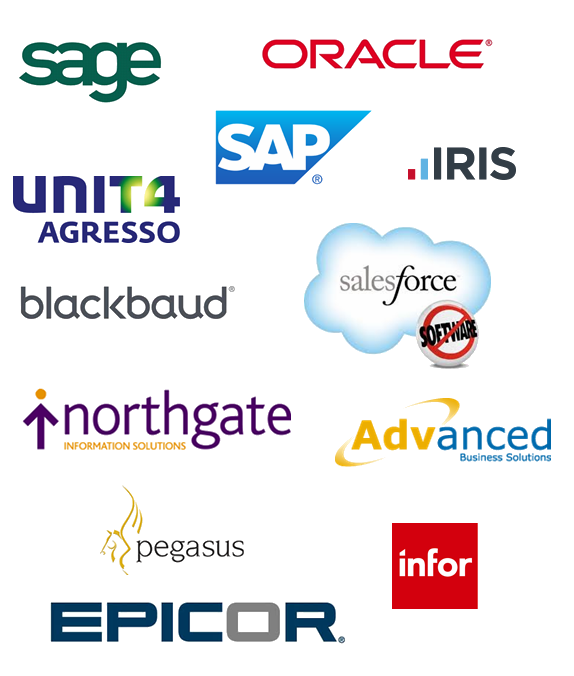

#  **Tipos de Sistemas de Gestión de Información**

## - **ERP:** 

Dentro de los 3 tipos de sistemas de gestión de información, el que mas destaca y el mas utilizado son los **ERPs**.

Un ERP *(Enterprise Resource Planning)* es un **sistema informatico** el cual integra los **múltiples procesos específicos** que hay en una empresa.

**¿Como podria definir a un ERP?**


+ Un ERP, se considera como un producto para un sistema, el cual es creado e implantado **para cubrir una necesidad** sin tener que estar dirigido y personalizado para una empresa en concreto. Este **producto** es adaptado **posteriormente** al **cliente**.

+ También un ERP, se considera un producto software. Los famosos **Consultores** no solo se dedican a la **implantación de la instalación** de dicho producto software; sino que **también** a adaptar este software a **los procesos de la empresa**.

## - **Caracteristicas y Beneficios del uso de ERPs**

Puedo destacar entre varias las siguientes:

+ **Funcional**: Un ERP debe de solucionar todos los procesos del negocio.

+ **Modular**: Cada uno de sus modulos debe de poder ser integrado de manera **opcional** e **independiente**

+ **Centralizado**: La base de datos del cual se sostiene debe de ser **única** y los datos **no han de estar replicados** en múltiples fuentes.

+ **Robusto**: Debe incorporar mecanismos que garanticen **fiabilidad** de datos.

+ **Seguro**: Tiene que incorporar mecanismos que garanticen **integridad** de los datos.

+ **Mantenible**: El sistema debe de ser apto para **mantenerse, mejorarse y ampliarse**

+ **Adaptable**: Tienen que ser soluciones **génericas**, lo suficientemente flexibles como para **integrarse en cualquier compañia**.

## - **Tipos de ERPs**

+ **Genéricos**: Producto modular que facilita la escalabilidad, economicos pero excasa adaptabilidad.

+ **Configurables**: Núcleo de sistema basado en **multiples parámetros modificables; permitiendo adaptar los procesos.

+ **A Medida**: Consistente basado en los requisitos de la empresa. Una opción de **gran inversión**.

## - **Beneficios**

+ Optimiza los **procesos de gestión**.
+ Mejora la **productividad**.
+ Simplificación de las **tecnologías de la información** de la compañía.
+ Mejora en los **procesos de decisión** en consecuencia de la **centralización** de la información y del acceso a los datos en **tiempo real**.
+ Reduce costes de **gestión de la información**.
+ Facilitan la **escalabilidad del sistema**.
+ Permiten incrementar la **seguridad de la información**.

**EJEMPLO ERPs**:
```Markdown
+ SAP
+ NetSuite / ERP Cloud (Oracle).
+ SAGE
+ Microsoft Dynamics 365 (Microsoft).
+ IFS.
+ ERPNext (Libre).
+ Odoo (Libre).
+ Apache Ofbiz (Libre).
+ WebERP (Libre).
```
